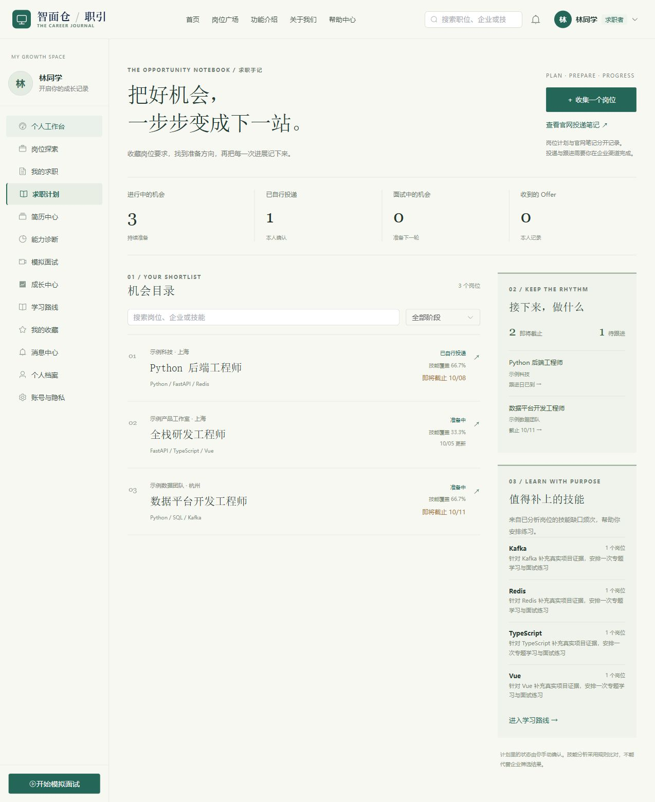
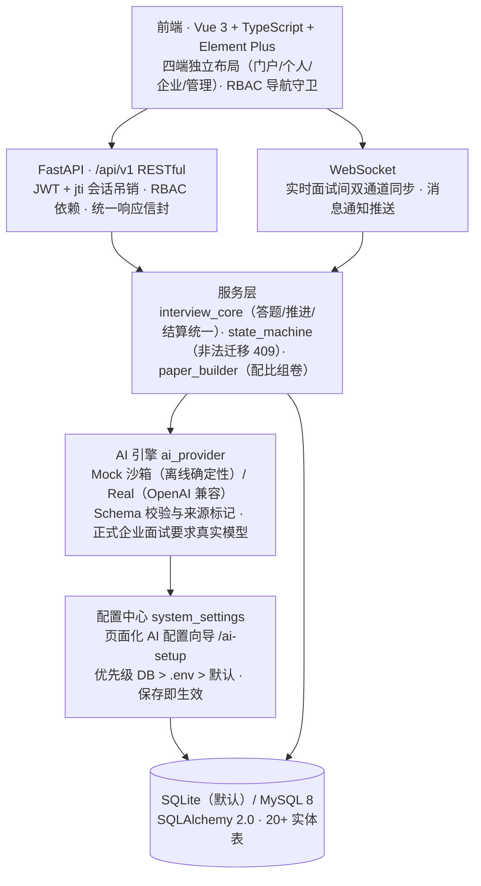

# 智面舱 — AI 驱动的面试与人岗协同平台

<p align="center">
  <strong>四端一体化：公共门户 × 求职者模拟面试成长 × 企业全流程招聘 × 平台治理后台</strong>
</p>
<p align="center">
  
  
  
  
  
  
</p>

> 遵循《系统开发规划书 V1.0.1》完整落地：学生端模拟面试与能力雷达诊断、企业端全流程招聘协同、管理后台平台治理与 AI 服务调度。定位为竞赛作品 / 校内演示，**零 API Key 开箱即用**，接入真实大模型只需在页面上填一次配置。

---

## 🚀 快速开始 — 无需配置，3 分钟跑起来

Windows 可直接**双击 `一键打开.bat`**，自动检查依赖、启动前后端，等待服务就绪后打开浏览器。重复打开会复用已运行的服务；双击 `一键关闭.bat` 可停止后台服务。仅调试后端 API 可双击 `start_backend.bat`（直接打开 Swagger）。启动日志保存在 `logs/`。首次缺少依赖时会自动联网安装，需要已安装 Python 3 和 Node.js。

手动安装和启动步骤：

```bash
# 1) 后端：虚拟环境 + 依赖（一次性）
python -m venv .venv
.venv\Scripts\python.exe -m pip install -r backend\requirements.txt   # Windows
# source .venv/bin/activate && pip install -r backend/requirements.txt  # macOS/Linux

# 2) 前端依赖（一次性）
cd frontend && npm install && cd ..

# 3) 启动
一键打开.bat         # Windows 一键；或手动分别执行下方命令
```

```powershell
# 后端（端口 8000，含热重载）
cd backend && ..\.venv\Scripts\python.exe -m uvicorn main:app --host 127.0.0.1 --port 8000 --reload
```
```bash
# 前端（新开终端，Vite 已代理 /api、/ws、/uploads → 8000）
cd frontend && npm run dev
```

- 前端：http://localhost:5173 · Swagger 文档：http://127.0.0.1:8000/docs
- 首次需要演示数据时执行：`cd backend && ..\.venv\Scripts\python.exe scripts\seed_demo.py`
- `.env` 可从 `.env.example` 复制创建；**不配 LLM Key 也能完整体验**（内置确定性 Mock 引擎）

更新代码后，先双击 `一键关闭.bat`，再双击 `一键打开.bat`，让后端加载新接口并自动执行数据库迁移。已有数据库请先备份；旧登录凭证可能需要重新登录。

## 本次升级

- **简历中心双区管理**：「在线简历」与「原文档」分 Tab 存放——上传的 PDF/DOCX 进入原文档库（左侧列表 + 右侧内嵌预览），一键 AI 解析生成**独立的**在线简历，不污染手工编辑内容；在线简历支持结构化编辑、AI 诊断与一键优化。
- **AI 解析提速**：qwen3 系列关闭思考模式（`enable_thinking:false`），整篇简历解析耗时从约 90 秒降至约 10 秒；解析 prompt 显式约束输出结构，模拟结果一律拒绝写入真实简历。
- **求职计划**：收集外部岗位或从平台岗位加入计划，根据本人简历分析技能覆盖与缺口，整理求职信、跟进草稿及 STAR 面试素材，记录进度、截止日期与跟进提醒。分析和准备包使用规则与已有简历材料，并标记来源。
- **官网投递**：岗位提供企业官网入口；实际投递由用户在官网完成，本系统记录访问与用户确认的投递状态。
- **面试可靠性与权限**：幂等作答、并发保护、报告失败重试、服务端计时、有效会话校验、WebSocket 短期票据及私有文件授权下载。
- **界面设计**：暖白纸面、墨绿重点色和杂志式布局，个人空间与主要求职页面适配手机。

使用流程、接口、迁移与验证边界见 [求职计划说明](docs/job-search-workspace.md) 和 [官网投递与后端升级说明](docs/official-apply-backend.md)。参考项目归属见 [第三方许可](THIRD_PARTY_NOTICES.md)。



## 🔑 演示账号（密码均为 `123456`）

| 角色 / 端入口 | 登录账号 | 角色说明 |
|:---|:---|:---|
| **个人求职者端** | `student@example.com` | 拥有简历、模拟面试记录、成长雷达图与待办学习任务 |
| **企业创建人 (Owner)** | `owner@example.com` | 华为技术有限公司超级管理员，享全权限 |
| **企业招聘负责人 (HR)** | `hr@example.com` | 发布岗位、推进看板与发送面试邀约 |
| **企业业务面试官** | `interviewer@example.com` | 查阅候选人档案与提交结构化评估 |
| **平台系统管理员** | `admin@example.com` | 独立治理后台入口 `/admin/login`：资质/岗位审核、投诉处置、题库与 AI 引擎管理 |

## ⏱️ 3 分钟完成一次完整体验

| 步骤 | 去哪 | 做什么 | 你会看到 |
|---|---|---|---|
| **1** | `student@example.com` 登录 | 进入个人工作台 | 真实统计的待办、最近面试分与目标岗位 |
| **2** | 简历中心 | 原文档 Tab 上传 PDF 并「解析为在线简历」，或在线新建后 AI 诊断 | ~10 秒生成独立在线简历；诊断给出优化建议，可**一键 AI 改写并应用**（不虚构事实） |
| **3** | 模拟面试 → 创建 | 选岗位自动带出 JD（可手改），预览组卷后开考 | 86 题结构化题库按 专业:通用:压力 配比抽卷，逐题限时 |
| **4** | 实时面试间 | 文字或语音口述作答 | AI 六维 Rubric 评分 + 答得好自动**追加同技能更难追问**；服务端计时，刷新不丢 |
| **5** | 面试诊断报告 | 交卷后查看 | 五维雷达、逐题参考答案要点对照、用时与超时分析 |
| **6** | 成长中心 / 学习路线 | 一键生成学习规划 | 命中 5 大 AI 岗位模板库：分阶段任务带**产出物 + 推荐资源 + 建议周期**，打卡真实发放能力分 |
| **7** | `hr@example.com` 登录 | 职位管理 → AI 解析 JD 发布 | 岗位进管理后台待审；`admin@example.com` 在 `/admin` 审核通过后上架 |

## 🏗️ 架构图



## 🧰 技术栈

FastAPI · SQLAlchemy 2.0 · Pydantic v2 · python-jose (JWT) · passlib/bcrypt · httpx · WebSocket · Vue 3 + TypeScript + Vite + Pinia + Vue Router · Element Plus · ECharts（雷达/趋势图）· SQLite / MySQL 8 · Docker Compose

## 🔩 核心实现

- **双引擎 AI 架构**：`AIProvider` 统一封装 9 类任务（简历解析/优化/改写、JD 解析、出题、六维评分、报告、学习路线、匹配解读），每个任务带 Pydantic Schema 校验并记录实际来源。个人模拟可离线演示；正式企业面试拒绝模拟评分和报告，简历解析失败不会写入虚构经历。
- **管理员 AI 配置向导**（`/ai-setup`）：管理员页面填写 API Key / Base URL / 模型（OpenAI、DeepSeek、通义、Kimi、本地 Ollama 预设），支持连接测试和密钥掩码回显，保存即生效；配置修改、测试和用量数据均要求平台管理员权限。
- **结构化题库 + 组卷引擎**：86 题（62 专业 / 12 通用 / 12 压力）覆盖 11 个岗位大类，按面试模式配比抽题、技能优先命中、题干去重；卷面 JSON 快照固化，历史可复现；管理后台可视化维护（只停用不物理删除）
- **会话状态机与双通道统一**：`READY→IN_PROGRESS⇄PAUSED→COMPLETED/CANCELLED` 集中声明；REST 与 WebSocket 共用 `interview_core`。作答带题目与请求标识，同一请求重试返回已保存的结果，冲突内容或非法状态返回 409；支持中止与报告恢复。
- **服务端权威计时**：以题目呈现时间为锚点计算真实单题用时并覆盖客户端上报；超时轻扣分（30s/3 分、上限 15 分、不归零）、空作答判 0、暂停豁免；归零自动交卷结算
- **自适应追问**：评分返回的 `next_action` 驱动——答得好插同技能更高难度题、答得差插更低难度题（每场上限 2 次），卷面实时记录
- **闭卷与复盘机制**：作答中不下发参考答案；结算后报告逐题对照要点，直接衔接学习路线补短板
- **语音链路（零云端成本）**：浏览器原生 Web Speech API 口述转写 + `speechSynthesis` 题目朗读，设备检测真实化（摄像头/麦克风数量、TTS 能力、后端往返实测）
- **学习路线混合架构**：5 个 AI 岗位模板库（含产出物/推荐资源/建议周期）× 面试薄弱项确定性个性化；未命中回退 LLM 动态生成；打卡真实发放能力分（+2、幂等）并沉淀成长曲线
- **治理与安全**：JWT + jti 有效会话校验支持强制下线；越权 403、超管保护拦截；登录账号历史本地化（密码绝不落本地）。找回密码要求可用 SMTP，不返回开发重置令牌；修改密码撤销旧会话。私有文件按所属授权下载，AI 调用日志脱敏。

## 📊 功能矩阵（规划书 V3.0 对照）

- [x] **公共门户**（P01 首页 / P02 职位广场 / P03 职位详情 / P04 企业主页 / P05 核心特性 / P06 关于 / P07 帮助）
- [x] **认证流程**（A01 登录 / A02 注册选择 / A03 个人注册 / A04 企业注册 / A05 入驻指引 / A06 找回密码 / M01 后台登录 / AI 引擎配置向导）
- [x] **个人求职者端**（U01 工作台 ~ U16 账号安全：含简历中心双区管理（在线简历 + 原文档库内嵌预览）、AI 诊断与一键优化、六维胜任力评估、模拟面试全流程、成长中心、学习路线、消息通知）
- [x] **企业协作端**（E01 工作台 ~ E15 资质认证：AI-JD 发布、候选人匹配、看板流转、结构化面试评价、人才库、数据分析）
- [x] **平台管理端**（M02 运营总览 ~ M10 审计日志：用户/企业治理、资质与岗位审核、投诉处置、题库管理、AI 引擎与脱敏日志）
- [x] **核心技术规范**（SEC-01~07 安全准则、4 态统一容器、ECharts 雷达图、SQLite/MySQL 实体持久化）

## ✅ 测试与验证

| 维度 | 结果 |
|---|---|
| 后端回归 | `python -m pytest tests -q --disable-warnings -p no:cacheprovider`：**68 项通过**，测试使用隔离临时数据库与模拟 AI |
| 类型检查与构建 | `npm run build`：Vue TypeScript 检查和 Vite 生产构建通过，公共依赖仍有包体积提示 |
| 浏览器实测 | 隔离演示数据验证桌面与 390 px 手机布局、官网投递笔记和求职计划的分析、准备、进度与跟进流程 |
| 数据诚实性 | 新统计使用实际记录，无依据时显示未知或空态；既有演示及历史记录保留，模拟评分不写入新的正式技能证据 |

## ⚙️ 环境变量（`.env`，均可选）

| 变量 | 说明 |
|---|---|
| `DATABASE_URL` | 默认 SQLite 单文件；生产可切 `mysql+pymysql://...` |
| `SECRET_KEY` | JWT 签名密钥，**生产必改**为强随机串 |
| `AI_MODE` | `REAL`（默认）或 `MOCK`；模拟和回退会标记实际来源，正式企业评分和报告要求真实模型 |
| `LLM_BASE_URL` / `LLM_API_KEY` / `LLM_MODEL` | OpenAI 兼容端点三件套；可在管理员 `/ai-setup` 页面配置（页面配置优先级高于 `.env`，保存即时生效） |
| `SMTP_HOST` / `SMTP_USER` / `SMTP_PASSWORD` / `SMTP_FROM` | 找回密码邮件；未配置或发送失败时不返回重置令牌 |
| `FRONTEND_BASE_URL` | 邮件重置链接的前端地址 |
| `BACKEND_CORS_ORIGINS` | 允许跨域访问的前端地址列表 |
| `UPLOAD_DIR` | 上传目录，默认 `./uploads` |

## 🚢 Docker 部署

```bash
# 确认已从 .env.example 创建并修改 .env，然后在项目根目录执行
docker-compose up -d --build
```

编排包含 MySQL 8 + Redis 7 + Backend + Frontend 四服务。

## ⚠️ 已知限制与设计取舍

- **定位竞赛/演示**：登录验证码、接口限流、AI 异步任务队列、病毒扫描等"防御不存在威胁"的能力被明确划为范围外（理由与兜底见 `docs/功能完善与实现建议.md` 第五章），非遗漏
- SQLite 单文件适合个人/演示规模；多实例水平扩展请切 `DATABASE_URL` 至 MySQL
- 本次升级验证了 SQLite 迁移与模拟模式；MySQL 和真实模型服务需要在实际部署环境验证。
- `uvicorn --reload` 只监听 `.py` 文件，**修改 `.env` 需重启后端**；页面配置向导则保存即生效
- 管理端 AI 统计从调用日志计算成功率、延迟及用量，并区分真实与模拟来源；通知广播仍在当前进程内，多实例部署需要共享消息通道。
- 语音作答依赖浏览器 Web Speech API（Chrome/Edge 效果最佳），未接入云端 ASR

## 📚 项目文档

- [更新日志](docs/update_log.md) — 按日期记录全部功能落地与修复
- [求职计划工作台](docs/job-search-workspace.md) — 岗位收集、准备材料、跟进与技能缺口
- [官网投递与后端升级](docs/official-apply-backend.md) — 权限、可靠性、迁移与验证
- [待办与执行清单](docs/ToDoList.md) — 需求来源、决策记录、执行结果
- [功能完善与实现建议](docs/功能完善与实现建议.md) — 差距分析、范围决策与实施批次
- [V2 预审报告](docs/V2-PRE-AUDIT.md)

## 📁 工程目录

```
ai-interview-hub/
├── backend/
│   ├── app/
│   │   ├── ai/               # AI 引擎（Mock/Real 双模式 + Pydantic Schema）
│   │   ├── api/v1/           # RESTful 路由（公共/认证/个人/企业/后台/文件）
│   │   ├── core/             # 配置、数据库、JWT 安全、RBAC 依赖、状态机
│   │   ├── data/             # 学习路线岗位模板库
│   │   ├── models/           # SQLAlchemy 模型（含 system_settings 配置表）
│   │   ├── schemas/          # Pydantic v2 输入输出模式
│   │   ├── services/         # 面试核心服务、组卷引擎、AI 配置读写
│   │   └── websocket/        # 实时面试室与通知推送
│   ├── scripts/              # 种子数据与端到端冒烟测试
│   └── main.py               # 启动入口（端口 8000）
├── frontend/
│   └── src/
│       ├── api/              # Axios 封装与集中式接口
│       ├── components/       # 4 态容器、雷达图、图表组件
│       ├── layouts/          # 四端独立布局
│       ├── router/           # 全路由 + RBAC 导航守卫
│       ├── stores/           # Pinia（Token/User/权限）
│       └── views/            # 全量业务页面（U/E/M/P/A 系列 + AI 配置向导）
├── docs/                     # 产品与工程文档
├── 一键打开.bat            # Windows 一键启动（start_backend.bat 仅起后端）
└── docker-compose.yml        # 生产容器编排
```
